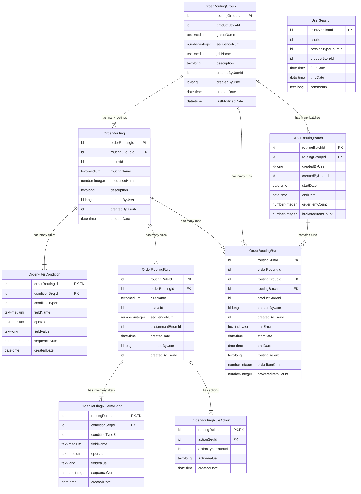

# Entity-Relationship Diagram: OrderRoutingEntities

Based on `runtime/component/OrderRouting/entity/OrderRoutingEntities.xml`.

## External Dependencies (Not visualised above for clarity)
- **moqui.service.job.ServiceJob**: Referenced by `OrderRoutingGroup.jobName`.
- **moqui.security.UserAccount**: Referenced by `createdByUserId` in multiple entities.
- **moqui.basic.StatusItem**: Referenced by `statusId` fields.
- **moqui.basic.Enumeration**: Referenced by EnumId fields (conditionType, assignment, actionType, sessionType).
